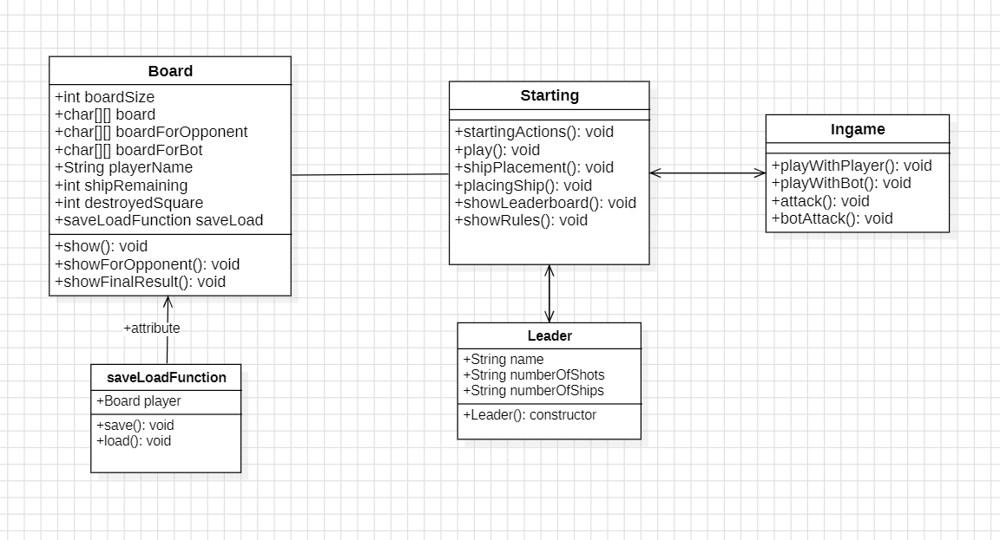
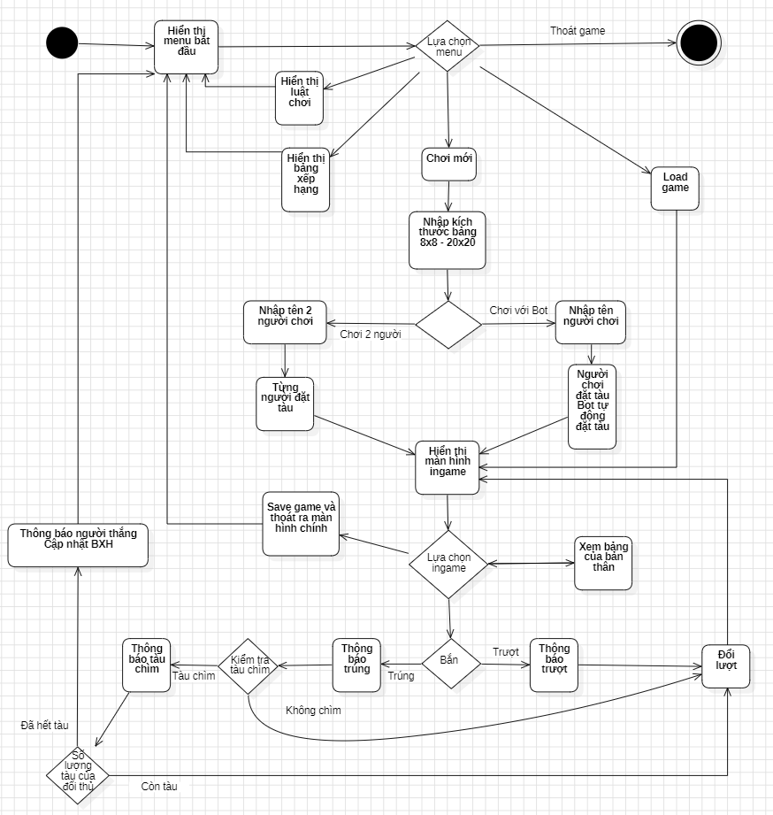

# UML

- Đây là folder sẽ chứa các file UML của nhóm
- Có thể sử dụng các công cụ sau để vẽ UML:
  - [StarUML](https://staruml.io/)
  - [Visual Paradigm](https://online.visual-paradigm.com/vpce/)
- Các file UML sẽ được lưu dưới dạng ảnh, và các em sửa file readme này đính kèm ảnh vào, ghi thêm giải thích nếu cần thiết

# Class Diagram

# Activity Diagram

